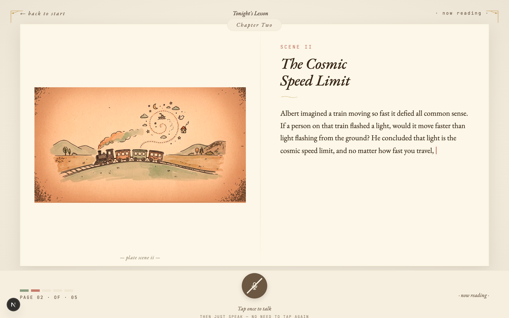

<div align="center">

# 🎙️ talkalong

<p><strong>A proactive AI tutor engine — it drives its own lesson, lets the listener interrupt for Q&A, then resumes the main line where it paused.</strong></p>

<p><em>Most "AI explainer" experiences are reactive: they wait to be asked. A good human teacher is proactive — they drive a plan, pause at the right moments, and when interrupted they answer and rejoin the thread without losing their place. talkalong is the orchestration engine that does this.</em></p>

[](https://github.com/clfhaha1234/talkalong/actions/workflows/ci.yml)
[](./LICENSE)
[](https://nodejs.org/)
[](./agora-voice-demo/scripts/qa-bench/README.md)
[](https://www.agora.io/en/products/conversational-ai-engine/)

<br>



</div>

## 🧠 What this is really about

Not *"can an LLM read a script aloud?"* — TTS has done that for a decade. The real
question: *can an AI sustain a proactive monologue, **survive an off-topic interruption**,
answer it in character, and rejoin its own thread without losing where it was?*

That's the loop a human teacher runs all day, and the one most AI products skip — they
wait politely, then forget the thread the moment you go off-piste. **talkalong is the
orchestrator that makes the loop work end-to-end.** We prove it on a children's storybook
tutor (the highest-stakes correctness setting — you can't fake continuity in front of a
6-year-old); the same engine generalizes to any long-form content: a paper walkthrough,
an onboarding doc, a museum guide, a Khan-style lesson.

## 🎬 See it in action

> 🤖 *"Lily wandered into a forest where the trees had silver bark, and..."*
>
> 🧒 *(interrupts)* **"Wait, why is the bark silver?"**
>
> 🤖 *(stops mid-sentence)* *"Because of the moonlight catching the leaves — silver bark is what very old trees grow where the moon is always full. Now — where were we... Lily had just stepped into the silver forest, and a small fox came out from behind a tree..."*
>
> 🧒 *(interrupts again)* **"用中文讲故事。"**
>
> 🤖 *(switches language, keeps the same Lily, same forest, same fox)* *"莉莉刚刚走进银色的森林，一只小狐狸从树后探出头来……"*

Three things a vanilla chatbot would flub: it **stopped the instant the kid spoke**,
**answered in narrator voice** and bridged back *mid-sentence* (not from the top), and on
the language switch **kept the canon** — same characters, same scene. Plot never resets.

## 🎯 Who it's for

A drop-in **interruptible-narration engine** for any product that reads long-form
content aloud and has to handle *"wait, back up"* gracefully — ed-tech tutors,
audiobook & news readers, guided onboarding, museum & accessibility guides. It's
content-agnostic (swap the storybook layer for a paper/doc/tour segmenter),
language-agnostic (generates in whatever language the user types), and
voice-provider-agnostic (any vendor with text-injection + barge-in) — so the same
engine scales across domains, languages, and regions rather than one local use case.

## 🏗️ How it works (in one breath)

**Structure** content into a segmented script → **orchestrate** a state machine
(`NARRATING → INTERRUPTED → QA → RESUMING`) that owns the main-line progress and a resume
planner (`{strategy, bridge_text, replacement_segments}`) → all spoken through a single
**Agora Conversational AI** channel via v2.6 text-injection, so narration and Q&A are
indistinguishable to the listener and interruption is handled uniformly.

Agora rents the mouth and ears (~340–650ms voice I/O, auto-interrupt). The brain — the
scheduling logic that keeps the thread — is the moat.

→ **Full architecture, the moat table, and the 3 designs we rejected: [docs/architecture.md](docs/architecture.md)**

## 🚀 Quick start

**A — the voice tutor (the interactive engine):**

```bash
cd agora-voice-demo
pnpm install
cp .env.example .env.local                # fill in: Agora App ID + Cert + GOOGLE_API_KEY
pnpm run dev                              # → http://localhost:3000/tutor
```

Type a topic; it generates a 5-scene illustrated story, reads it aloud, and takes mid-story
voice interrupts. (Needs Agora credentials with **Conversational AI enabled** + a
[Gemini API key](https://aistudio.google.com/apikey); `pnpm run doctor` checks your setup.)

**B — the breathing storybook video (Remotion side):**

```bash
npm install && npm run generate           # preprocess demo_img.jpeg + render
open out/video.mp4
```

The two halves are independent projects (Remotion = npm, Next.js = pnpm). See
[docs/remotion.md](docs/remotion.md).

## 🧪 Tested & data-backed

Every non-obvious decision has a frame, data, and a conclusion — not vibes.

- **186 unit tests** + a prod-faithful Q&A bench + a fake-mic audio e2e (`pnpm test`; details in [`scripts/qa-bench/README.md`](agora-voice-demo/scripts/qa-bench/README.md)).
- **Design decisions settled by experiment** (single-shot vs. agentic, model picks, prompt strategy) — [`agora-voice-demo/docs/experiments/`](agora-voice-demo/docs/experiments/).

## 📚 Docs

- [Architecture deep dive](docs/architecture.md) — core loop, moat, rejected designs
- [FAQ](docs/FAQ.md)
- [Subproject README](agora-voice-demo/README.md) — the voice tutor in detail
- [Engine PRD](agora-voice-demo/docs/proactive-tutor-engine-prd.md) (v0.3, architecture locked)
- [AGENTS.md](agora-voice-demo/AGENTS.md) — agent contracts
- [Building with an AI assistant → AgoraIO/skills](https://github.com/AgoraIO/skills)

## 📄 License

[MIT](./LICENSE). The `agora-voice-demo/` subproject was forked from
[AgoraIO-Conversational-AI/agent-quickstart-nextjs](https://github.com/AgoraIO-Conversational-AI/agent-quickstart-nextjs)
(MIT) and heavily customized into the proactive-tutor orchestrator described above.
