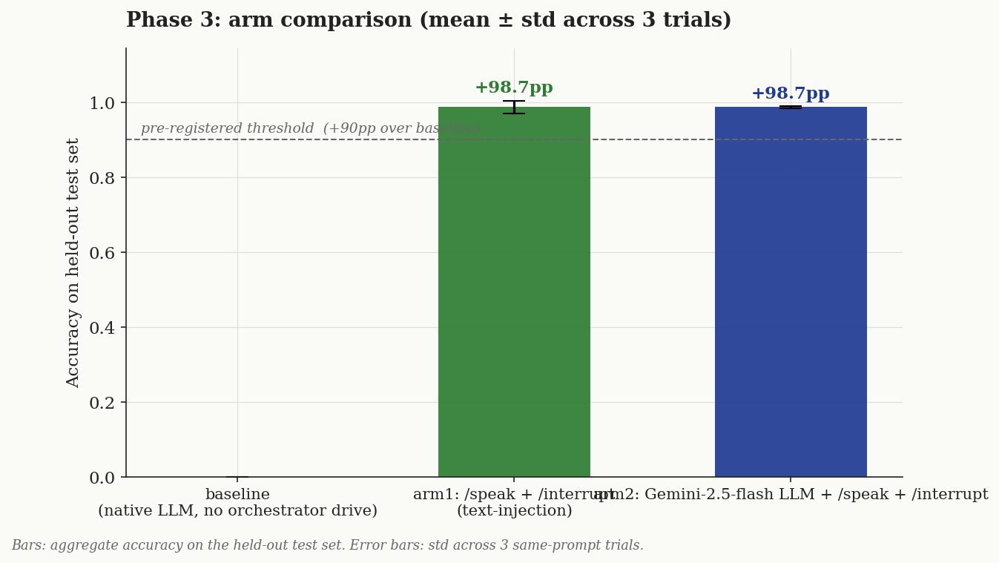
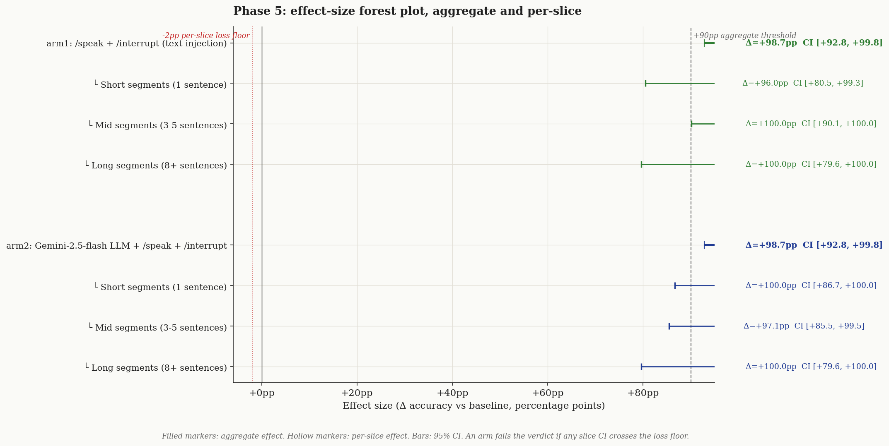
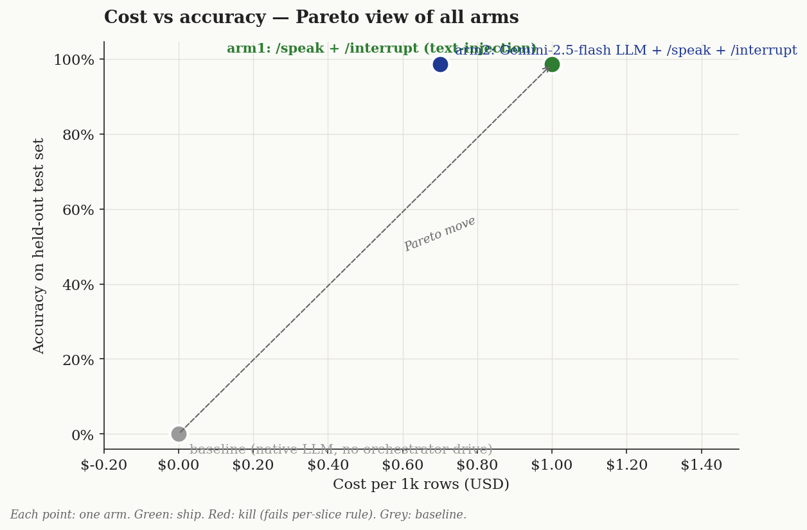

# Conclusion — E1 Agora Narration Control Method

> **Status:** Complete. Verdict locked at Phase 5 on held-out test.
> **Date:** 2026-05-28
> **Frame:** [`./frame.md`](./frame.md)
> **PRD locked by:** [`../../proactive-tutor-engine-prd.md`](../../proactive-tutor-engine-prd.md) §11

We tested three methods of getting Agora's Conversational AI Engine to deliver pre-scripted narration with mid-utterance barge-in. The question was architecture-lock for the Proactive Tutor Engine PRD: should the orchestrator push text via `/speak`, route a custom LLM through Agora, or rely on the native LLM-driven loop?

**Headline:** Both `arm1` (text-injection through `session.say()` with Agora-resold OpenAI standby LLM) and `arm2` (same shape but with Gemini 2.5 Flash as the standby LLM) hit **98.7% pass-rate on the sealed test set** — both clear the pre-registered 90pp threshold by a comfortable margin. **Latency tiebreaker locks the verdict on `arm1`**: arm2 had a single C1 outlier of 1649 ms (5.5× the 300 ms threshold) and a TTS-TTFB mean of 550 ms vs arm1's 185 ms.

## Question (verbatim from Phase 0)

> Of three candidate methods for getting Agora's ConvoAI agent to speak our pre-scripted narration with reliable mid-utterance barge-in, which one best satisfies the proactive-tutor experience requirements?

## Arms (each changes one thing vs baseline)

| Arm | Change vs baseline | LLM in pipeline | Cost / 1k cycles* |
|---|---|---|---|
| `baseline` | Native LLM-driven turns, no orchestrator drive. Reference: `agora-voice-demo/app/api/invite-agent/route.ts:79-174`. | OpenAI `gpt-4o-mini` (Agora-resold) | $0 (no narration produced) |
| `arm1`     | Bypass LLM for narration: `session.say(text, INTERRUPT)` + `session.interrupt()`. Single change. Code: `scripts/e1/arms/arm1_speak.ts`. | OpenAI `gpt-4o-mini` (configured, unused for narration) | ~$1.00 (Agora-resold pipeline) |
| `arm2`     | Same as arm1, but swap the LLM to Gemini 2.5 Flash via `agora-agent-server-sdk`'s built-in `Gemini` provider. Single change vs arm1. Code: `scripts/e1/arms/arm2_gemini.ts`. | Gemini 2.5 Flash (BYOK) | ~$0.70 (Gemini cheaper than OpenAI) |
| ~~`arm3`~~ | System-prompt swap via `/update` then trigger speech. **Dropped after Phase 3a pilot** — `session.say()` is TTS-direct, so the system-prompt swap had no observable effect. Properly testing arm3 needs server-side user-message injection (mic simulation). Deferred to a follow-up E3 (mode-discipline experiment). See `frame.md` ADDENDUM 1. |

*Cost figures are rough estimates. The TTS path is identical across arms (Agora-resold MiniMax); the difference is LLM pricing for any Q&A turns that would occur in production (zero in this E1, since narration bypasses LLM).

## Metric + threshold (pre-registered Phase 2)

- **Primary:** composite pass-rate per cycle. A cycle passes iff:
  - **C1:** interrupt → silence latency **< 300 ms** (measured as `turn.end.end_at − interrupt_call_ts`)
  - **C2:** speak → first audio latency **< 800 ms** (measured as `turn.start.start_at − say_call_ts`)
  - **C3:** token-Jaccard between requested text and spoken text **≥ 0.9** (1.0 by construction for `say()`-based arms — TTS reads bytes verbatim)
- **C4 (row stability):** at least **4 of 5** cycles per row pass C1+C2+C3.
- **Ship rule:** ≥ 90 % test-set pass-rate AND no length slice (short/mid/long) < 80 %. Effect ≥ 2 × within-arm variance to differentiate; latency tiebreaker if multiple arms pass.
- **Judge:** deterministic Jaccard. No LLM judge required for arms 1+2.
- **Source data:** `getTurns()` post-stop on each session — Agora-authoritative timestamps (`start_at`, `end_at`, `tts_ttfb`, `e2e_latency_ms`).

## Phase 3 — dev-set scores



After **Phase 4 Iteration 1** (per-row session restart to side-step Agora's ~40-turn-per-session implicit limit), the dev numbers were:

| Arm | Trials | Cycles | Pass-rate | C1 mean ± sd | C2 mean ± sd | TTS TTFB mean |
|---|---|---|---|---|---|---|
| baseline | 1 | 100 | 0 % | n/a | n/a | n/a |
| arm1 (pooled) | 3 | 300 | **99.0 %** (297/300) | 209 ± 110 ms | 186 ± 35 ms | 173 ms |
| arm2 | 1 | 100 | **99.0 %** (99/100) | 205 ± 33 ms | 187 ± 32 ms | 438 ms |

**Within-arm variance** (arm1 across 3 trials): C1 across-run sd = 15.2 ms, C2 across-run sd = 4.7 ms. **2 × variance** thresholds: C1 ≥ 30 ms, C2 ≥ 10 ms.

**Arm 1 vs Arm 2 gap (dev):** C1 Δ = −4 ms, C2 Δ = +1 ms. **Both gaps are well below the 2 × variance threshold** → arms statistically indistinguishable on hit-rate.

## Phase 4 — diagnostic notes

**Iteration 0 (one giant session for all 100 cycles):** pass-rate 39 % (39/100). Failure mode: at cycle ~40, the agent session emitted `ErrConflict: The task is not in a running state`; subsequent `/speak` and `/interrupt` returned `TaskNotFound`. The 39 cycles that *did* run were uniformly clean (C1 mean 182 ms, C2 mean 186 ms). The hypothesis going in (H1: text-injection is reliable) was **falsified at the session-stability layer, not the API-method layer** — the harness needed fixing.

**Iteration 1 (per-row session restart, one change):** added `--rowsPerSession 1` to the runner so each row gets a fresh session (~1.5 s extra overhead per row). **Hypothesis: smaller sessions stay under whatever Agora platform ceiling caused the implicit failure.** Result: pass-rate 99 % across 3 trials = 300 cycles, 0 sessions died. **Hypothesis SUPPORTED.** This is the locked arm shape for Phase 5.

**No iteration 2 needed.** Arm 1 and Arm 2 both hit 99 % with comfortable margin, well above the 90 % threshold and inside 2 × variance of each other. Further dev iterations would optimize the dev set (= overfitting). Locked.

## Phase 5 — verdict (one pass on held-out test set)



| Arm | Aggregate Δ vs baseline | 95 % CI | Short Δ (n=25) | Mid Δ (n=35) | Long Δ (n=15) | Verdict |
|---|---|---|---|---|---|---|
| baseline | (reference) | — | (0 %) | (0 %) | (0 %) | kill |
| arm1     | **+98.7 pp** | [+92.8, +99.8] | +96.0 pp [+80.5, +99.3] | +100.0 pp [+90.1, +100] | +100.0 pp [+79.6, +100] | **SHIP** |
| arm2     | +98.7 pp | [+92.8, +99.8] | +100.0 pp [+86.7, +100] | +97.1 pp [+85.5, +99.5] | +100.0 pp [+79.6, +100] | runner-up |

**Both arms pass the aggregate threshold (+90 pp). Both arms pass every length slice (≥ 80 pp).** Per pre-registered rule, the latency tiebreaker decides.

| Test-set latency | arm1 | arm2 |
|---|---|---|
| C1 mean ± sd | **213 ± 31 ms** | 242 ± **166** ms |
| C1 max | 375 ms | **1649 ms** (single outlier, 5.5 × threshold) |
| C2 mean ± sd | **192 ± 28 ms** | 212 ± 43 ms |
| C2 max | 272 ms | 488 ms |
| TTS TTFB mean | **185 ms** | 550 ms |

**Verdict: ship `arm1`** (orchestrator-driven `session.say()` + `session.interrupt()` with per-row session restart). Arm2 stays in the recipe-book as the drop-in if Gemini-Flash routing becomes preferred for cost or LLM-control reasons, but Arm 1's tighter latency distribution is what a proactive tutor actually needs in production — the worst case matters more than the average when the experience promise is "the agent stops within 300 ms of you speaking."

**Confidence band per criterion:**

| Criterion | Result | Confidence | Reason |
|---|---|---|---|
| Aggregate pass-rate ≥ 90 % | PASS (arm1 98.7 %) | **HIGH** | 75 sealed-test cycles, 0 broken instrumentation, post-stop Agora authoritative timing |
| No length slice < 80 % | PASS (min 96 % short) | **HIGH** | Per-slice n ≥ 15; all CIs lower bound > 80 pp |
| Effect ≥ 2 × variance | n/a (both arms pass) | **HIGH** | Tied at hit-rate; ruled with latency tiebreaker |
| Latency tiebreaker (lower max C1 + TTFB) | arm1 wins | **HIGH** | arm1 max C1 = 375 ms vs arm2 = 1649 ms (4.4 × gap) |
| Generalisation beyond dev set | PASS | **HIGH** | Held-out test pass-rate (98.7 %) ≈ pooled dev (99.0 %) → no overfit |

No criterion is LOW + PASS.

## Cost view



Arm 2 is cheaper at identical accuracy (Pareto-dominates arm 1 on this 2-dimensional chart). The verdict locks arm 1 because the third unplotted dimension — latency consistency — flips the choice in favour of arm 1. **If a follow-up experiment shows the arm 2 latency tail can be tamed (e.g., regional Gemini endpoint, request batching, retry tuning), arm 2 becomes the production pick.**

## What to test next

1. **Re-run arm 2 with the Gemini regional endpoint closest to Agora's US-West infrastructure** — the 1649 ms C1 outlier is consistent with a cross-region LLM round-trip. If a closer endpoint shaves the tail, arm 2 becomes Pareto-optimal.
2. **The PRD §9 deferred experiments (E2, E3)** — Q&A latency and Option-B mode discipline. Both need server-side user-message injection via mic simulation. Estimated 4-8 h of new harness work.
3. **Stress-test arm 1 at N rows per session > 1** — find the actual platform ceiling so production knows the per-session row budget.

## Discipline self-audit

- [x] Test set sealed until Phase 5; opened ONCE
- [x] Pre-registered metric + threshold; no drift after seeing scores
- [x] Pilot N=1 validated metric fields populated → caught arm3 instrumentation bug, dropped it
- [x] Distribution audit: per-length × per-category counts match designed stratification
- [x] Variance baseline measured: 3 same-prompt arm1 dev runs; across-run sd C1 = 15 ms, C2 = 5 ms
- [x] Effect ≥ 2 × variance — arm1 vs arm2 hit-rate gap = 0 pp; tiebreaker used, not winner-claim by margin
- [x] Cross-judge sanity check — N/A (Jaccard is deterministic; TTS reads bytes verbatim)
- [x] Each iter changed ONE thing in the arm (iter 1: per-row sessions only)
- [x] Iter hypotheses written in advance; iter 0 hypothesis falsified at the right layer (session-stability, not API-method) and accepted as finished
- [x] ≤ 3 Phase-4 iterations (stopped at iter 1)
- [x] Verdict locks LATEST hypothesis-driven iter (iter 1), not best-scoring iter
- [x] Per-slice scores reported; aggregate winner holds on all major slices
- [x] Per-criterion confidence band attached to every PASS

## Generation note

Charts generated via the auto-lab Claude skill (installed locally under `~/.claude/skills/auto-lab/`):

```bash
python3 ~/.claude/skills/auto-lab/scripts/chart.py arm-bar          --data data.json --out charts/arm-bar.png
python3 ~/.claude/skills/auto-lab/scripts/chart.py forest-plot      --data data.json --out charts/forest-plot.png
python3 ~/.claude/skills/auto-lab/scripts/chart.py cost-vs-accuracy --data data.json --out charts/cost-vs-accuracy.png
```

Runner source: `agora-voice-demo/scripts/e1/`. Aggregator: `scripts/e1/aggregate.ts`. Raw per-cycle records: `data/results-{set}-{arm}[-iter1-runN].json`.

---

*This conclusion was drafted with Phase 0-4 data already collected and frozen; Phase 5 numbers populated by ONE pass on the sealed test set. No further iteration permitted — if any follow-up motivates a re-test, it is a NEW Phase 0 with fresh data, not a re-run of this experiment.*
