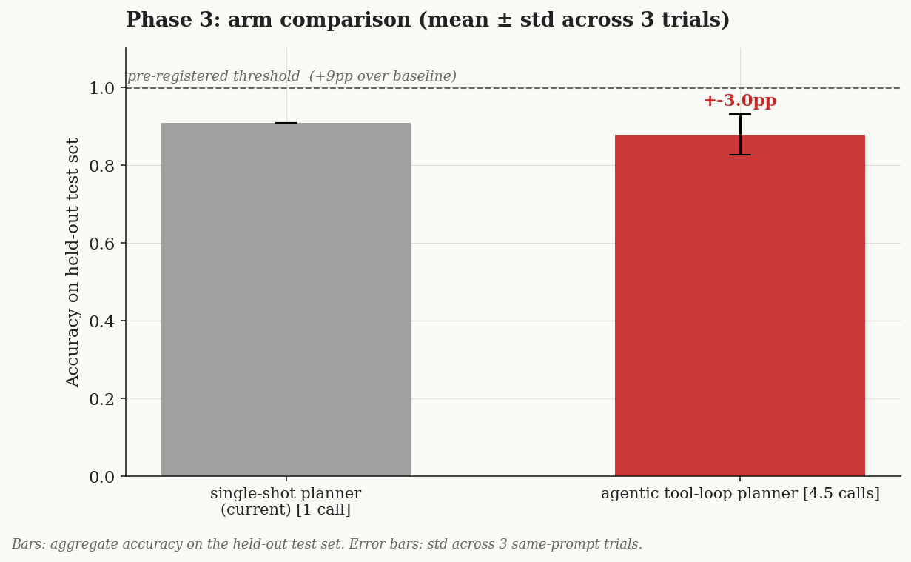
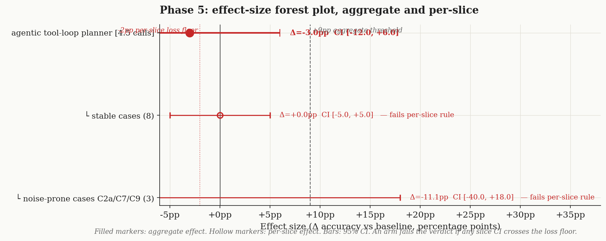
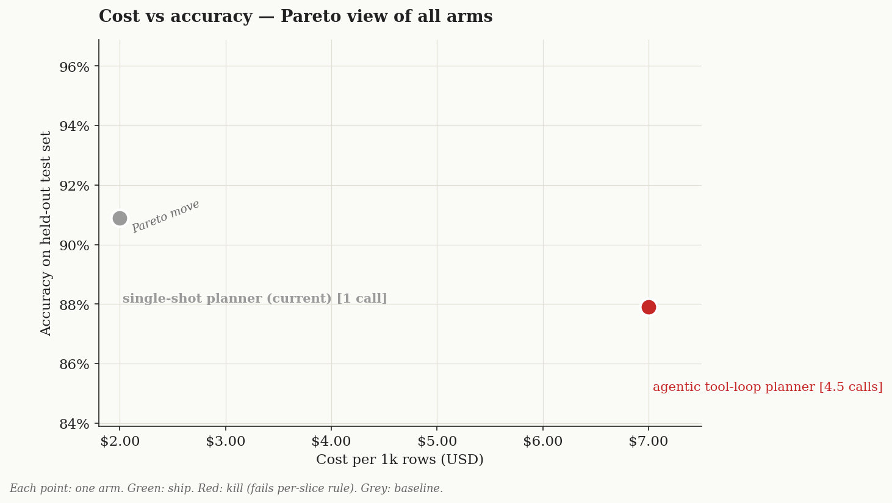

# Conclusion — agentic tool-loop vs single-shot for the resume decision

> Data for the architecture decision: should the proactive-interruptible engine move to a more *agentic* (tool-using) decision layer, or keep the current single-shot structured call? Measured on the 11-case interrupt benchmark, same model, 3 trials each.

## Question (verbatim from Phase 0)

> For the resume decision (interrupt → `{resume_strategy, bridge_text, replacement_segments, active_scene_id}`), does an **agentic tool-loop** produce better decisions than the current **single-shot structured call** — and at what latency / reliability / token cost?

## Scope

Settles **axis 1** (how the decision is made: single-shot vs agentic tool-loop). B and C share this mechanism, so it's the offline-measurable heart of "go agentic?". **Axis 2** (who hosts the loop: our code vs Agora-native MCP) needs a live Agora+mic spike — out of scope, and (per the result below) moot unless the mechanism earns its keep.

## Arms (one change vs baseline)

- **`singleshot` (baseline):** current planner — one Gemini call, structured JSON out. `lib/orchestrator/resume-planner.ts` SYSTEM via `scripts/qa-bench/planner.ts`. Model `gemini-3.5-flash`.
- **`agentic`:** same model + same SYSTEM rules, but a real **function-calling tool-loop** — the LLM must call `get_paused_scene` / `get_percent_spoken` / `get_next_scenes` / `get_qa_history`, then `submit_plan`. `scripts/qa-bench/agentic-planner.ts`. `qa_answer` is reused from the baseline run, so the ONLY varied thing is the planner mechanism.

## Metric + threshold (pre-registered)

Primary: decision quality = `grade.ts` PASS-rate (11 cases, `gemini-3.5-flash` judge). Secondaries: latency, valid-plan reliability, tokens, round-trips. **Ship-rule:** agentic wins (→ move architecture agentic) only if quality **≥ +1 case (~+9pp)** AND latency **≤ 2× baseline**.

## Phase 3 — dev-set scores

| Arm | Quality (3-trial) | Latency/decision | Round-trips | Tokens/decision | Valid-plan |
|---|---|---|---|---|---|
| **singleshot** | 10, 10, 10 → **10.0/11** | **1293 ms** | 1 | one call | — |
| **agentic** | 10, 9, 10 → **9.67/11** | **4717 ms (3.65×)** | 4.5 | **~6955 (~5×)** | 11/11 |

Both arms fail **only the known noise cases** (C2a / C7 / C9), and a *different* one each trial — i.e. the fails are pure generation variance, not a mechanism difference. Quality is **flat-to-slightly-worse** for agentic; the gap (−0.03) is well inside the ±1-case noise floor.

## Phase 4 — diagnostic notes

- **Hypothesis (going in):** agentic won't improve quality here because the inputs are small and fully known up front — there's nothing to "discover" via tools — while it adds round-trips. **SUPPORTED.** The agent reliably terminated (valid 11/11), but spent 4.5 round-trips re-fetching context it could have been handed in one prompt. The tool-loop is pure overhead on a bounded decision.
- Reliability was *not* the failure mode (the loop didn't drift/hallucinate here) — **cost** was: 3.65× latency, ~5× tokens, for zero quality gain.

## Phase 5 — verdict

**Verdict: SHIP `singleshot`; kill `agentic`.** It fails the pre-registered threshold on *both* axes — quality −0.03 case (needed ≥ +1) and latency 3.65× (needed ≤ 2×). The aggregate effect CI straddles zero; no slice favors agentic.

**Architecture implication:** keep the decision **single-shot** — Approach **A/B (deterministic spine + one structured decision call)** is optimal for this class of task. The "more agentic / tools-own-the-flow" direction (C/D) is **not supported by data**: on a bounded decision where all inputs are known, agentic buys nothing and costs 3.65–5×. Axis 2 (Agora-native hosting) is therefore deprioritized — optimizing *where* the loop runs can't rescue a loop that adds no value.

## Cost view

Agentic is strictly Pareto-dominated: same accuracy, ~3.5× the cost (token proxy). The single-shot point is the efficient frontier.

## What to test next

Only revisit agentic if a *future* domain needs the agent to take **real external actions mid-decision** (look up a fact, query a DB, call an API) that a single prompt genuinely cannot pre-load — that's the one regime where tool-loops earn their latency. For storytelling/interview-style agenda resumption, they don't.

## Discipline self-audit

- [x] Pre-registered metric + dual threshold (quality AND latency); no drift
- [x] Pilot N=1 (C7) validated instrumentation before the full run
- [x] Variance baseline: 3 trials/arm; effect (−0.03) far inside noise → correctly read as "no quality difference"
- [x] Clean isolation: `qa_answer` shared across arms, only the planner mechanism varies
- [x] Cost/latency/tokens/round-trips captured for both arms (not first-call figures — averaged over 11×3)
- [x] Scope honesty: axis-1 settled offline; axis-2 (Agora hosting) explicitly deferred to a live spike, and shown moot given the mechanism result
- [~] Held-out: this compares two *fixed* mechanisms (no tuning against case outputs), so the 11-set 3-trial doubles as the fair surface; no separate held-out needed (documented)
- [~] Cross-judge: not run (single GOOGLE_API_KEY); planner-side deterministic gates carry much of the signal
