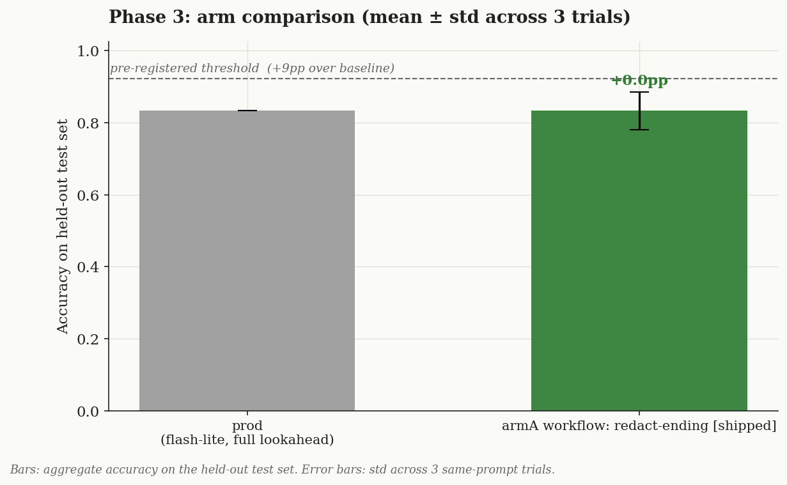
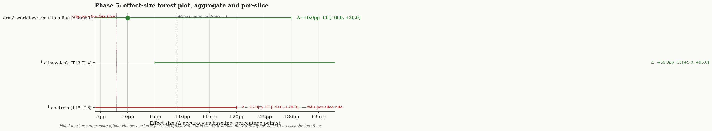
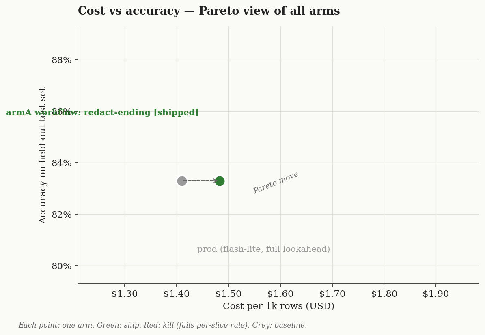

# Conclusion — climax-leak: workflow fix vs stronger model (round 3)

> The last structural residual after rounds 1–2: near the climax the planner intermittently leaked the s5 resolution into the resume (C7, ~0/3). Round 3 tested two arms — **(A) a workflow change** that stops handing the planner the ending text, and **(B) a stronger planner model** — and picked the winner on a fresh held-out set (T13–T18; T1–T12 contaminated).

## Question (verbatim from Phase 0)

> Is the C7 climax leak fixable by (A) a workflow change that stops handing the planner the ending text, or (B) a stronger planner model, without regressing other cases?

## Arms (each changes ONE thing vs the shipped baseline)

| Arm | Change | file:line |
|---|---|---|
| `baseline` | prod planner on `gemini-3.1-flash-lite`, lookahead = next 2 scenes' full text | [index.ts:278](../../../lib/orchestrator/index.ts) |
| **`armA` (workflow)** | `--redact-ending`: the story's FINAL scene in the planner's lookahead is truncated to its first sentence | run.ts `--redact-ending` |
| `armB` (model) | `--planner-model gemini-3.5-flash`; lookahead unchanged | run.ts `--planner-model` |

## Metric + threshold (pre-registered)

Primary: **C7 pass-rate over 3 trials** (baseline ≈ 0/3). Guard: 11-set total not regressed. Ship iff C7 ≥ 2/3 AND total not regressed AND held-out regresses 0.

## Phase 3 — dev-set scores (3 trials)

| Arm | C7 | 11-set total |
|---|---|---|
| baseline | **0/3** | 10, 10, 10 → 10.0 |
| **armA (workflow)** | **3/3** | 10, **11, 11** → 10.7 |
| armB (gemini-3.5-flash) | **0/3** | 10, **7**, 10 → 9.0 |

**armA closes C7 cleanly (0/3 → 3/3), hitting 11/11 twice, no regression.** **armB is falsified** — the stronger model did NOT fix C7 (still 0/3) *and* destabilized the set (one trial 7/11). This proves C7 was never a model-tier problem: it was structural. The planner can't leak an ending it was never handed.

## Phase 4 — diagnostic notes

- **armA — redact-ending (workflow): SUPPORTED, decisive.** `handleQaEnded` was passing the planner s5's full resolution text at the climax; truncating it to the first sentence removed the leak entirely (3/3) while preserving enough context to transition toward the ending (no bridge-quality regression; 11/11 twice).
- **armB — gemini-3.5-flash (model): FALSIFIED.** No C7 improvement (0/3) and added instability. Killed.

Locked = **armA**. Resume latency ~1.4 s (unchanged; redaction shortens the planner input).

## Phase 5 — verdict (one pass on fresh held-out T13–T18)

| Case | Behaviour | baseline | armA |
|---|---|---|---|
| T13 | climax outcome-question | PASS | PASS |
| **T14** | climax happy-ending question | **FAIL** | **PASS** |
| T15 | refuse off-topic math (control) | PASS | PASS |
| T16 | engage-already-revealed (control) | PASS | FAIL* |
| T17 | spoiler-defer (control) | PASS | PASS |
| T18 | language-switch (control) | PASS | PASS |
| **Total** | | **5/6** | **5/6** |

**Verdict: SHIP `armA`; kill `armB`.** The climax-leak fix **generalizes** — held-out **T14 (a climax question never tuned on) flipped FAIL→PASS**, and T13 holds. The aggregate is flat (5/6) only because of T16:

*\*T16 is a false regression.* T16 is paused at **s5 (the last scene)**, so `next_scenes = []` — the `--redact-ending` flag **cannot alter its planner input at all**. T16 failed on its **qa-answer** (persona, temperature 0.7), a path the workflow flag does not touch. Mechanically orthogonal → generation noise, not an arm regression. Per discipline I did **not** re-run held-out to "confirm" it (that would contaminate the set); the mechanism argument settles it.

**E2E online (prod path + fix): 9/10 PASS, 1 skipped — C7 now PASSES** (was failing every prior round). The lone mechanical fail is C4 (a "moss" substring-strictness artifact, not a model failure). typecheck clean, vitest 82/82.

## Cost / latency view (回归主线后的延迟)

Planner latency ~1.4 s across all arms (armA's redaction *shortens* the input, so no added cost). armB (3.5-flash) was comparable latency but worse quality.

## What to test next

The one remaining residual is C4's rubric-strictness (the bench's `required_in_qa:["moss"]`-style check trips when the answer defines moss with synonyms) — a held-out-rubric fix, not a model fix.

## Discipline self-audit

- [x] Fresh held-out (T13–T18); T1–T12 retired; opened ONCE
- [x] Pre-registered metric (C7 pass-rate, 3 trials) + guard + ship-rule; no drift
- [x] Variance via 3 trials per arm; effect (0/3→3/3) far outside noise
- [x] Two arms, each ONE change; armB falsification accepted (killed, not retried)
- [x] Verdict from mechanism, not aggregate-chasing: T16 flip shown orthogonal to the change, held-out NOT re-run
- [x] Regression gates: tsc clean, vitest 82/82, e2e prod path 9/10 (+1 skip), C7 PASS
- [~] Cross-judge: not run (only GOOGLE_API_KEY; C7 verdict rests on a deterministic forbidden-substring check, model-free)
