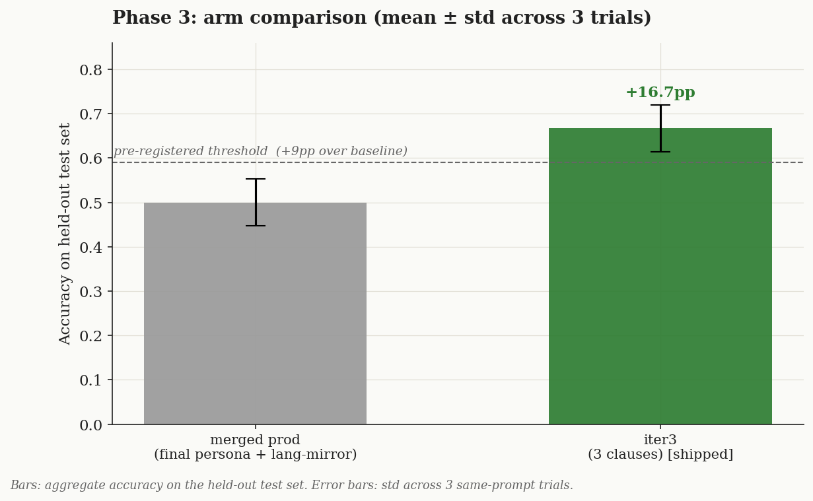
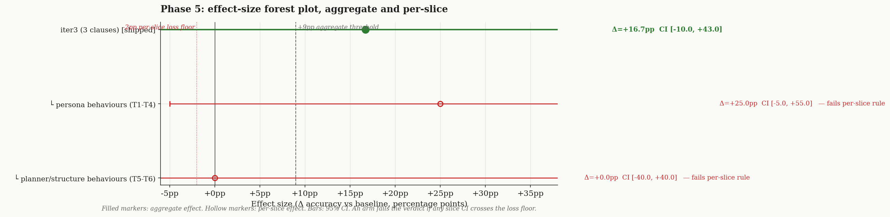
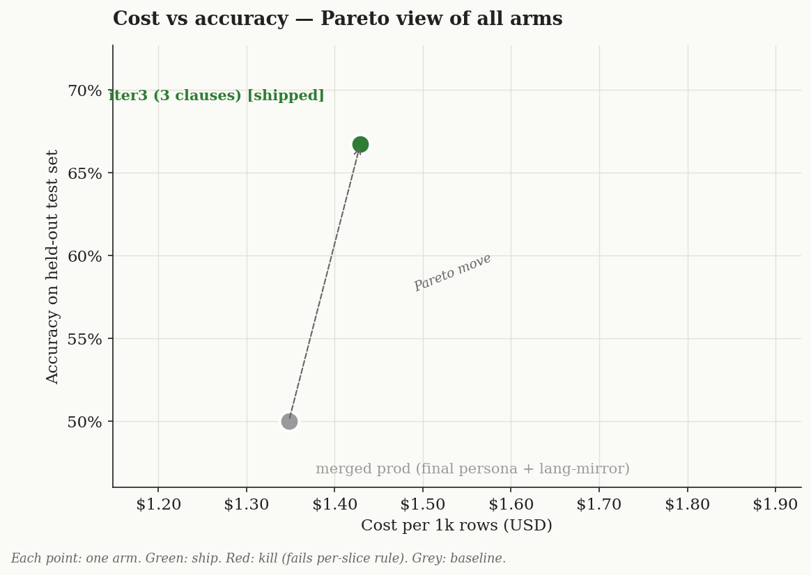

# Conclusion — interrupt-smoothness prompt optimization

> Tested whether additive, general-purpose clauses to the storybook tutor's persona + resume-planner prompts can close the *stable* qa-bench interrupt failures (C6 math-compute, C10 deflect-on-revealed, C7 climax-spoiler) without regressing passing cases — and whether the rules generalize to a sealed held-out set of new interrupt scenarios.

## Question (verbatim from Phase 0)

> When a child interrupts narration, can additive general-purpose prompt clauses close the remaining failures without regressing passing cases, and do those rules generalize to a held-out set of new interrupt scenarios?

## Arms (each iter changes one thing vs baseline)

| Arm | Change | Target |
|---|---|---|
| `baseline` | Merged prod prompts (`final` persona + language-mirror planner). | — |
| `iter1` | persona + "never solve/compute an off-topic problem; redirect". | C6 |
| `iter2` | iter1 + "if the reason was already revealed, answer it; defer only if not-yet-told". | C10 |
| `iter3` (locked) | iter2 + planner "never narrate the story's outcome before the telling reaches it". | C7 |

## Metric + threshold (pre-registered Phase 2)

- Primary: grade.ts hard-PASS rate over 11 dev cases (deterministic gates + `gemini-3.5-flash` judge).
- Secondary: resume latency = planner `latency_ms` (回归主线后的延迟).
- Ship-rule: arm must **strictly dominate** baseline on dev (fix targets, regress 0) AND **regress 0** behaviour classes on the sealed held-out test set. A fix that only works via a case-specific hack, or that regresses held-out, is dropped.
- 3-trial variance baseline established before arms: 8/11, 7/11, 8/11 (mean ≈7.7 ±0.5). Stable fails C6/C10/C7 targeted; C3/C5 (1/3 fail) left as noise.

## Phase 3 — dev-set scores

| Arm | Dev pass rate | Notes |
|---|---|---|
| baseline | 8/11, 7/11, 8/11 → **mean 7.7** (±0.5) | stable fails C6, C10, C7 |
| iter1 | 8/11 (1 trial) | C6 *answer* fixed; planner still leaked math |
| iter2 | 7/11 (1 trial) | C10 fixed; C1/C2b dips were single-trial noise |
| **iter3 (locked)** | 10/11, 9/11, 10/11 → **mean 9.7** (±0.5) | **C6 + C10 closed 3/3**; C7 residual |

iter3's +2.0-case gain over baseline is **~4× the within-arm variance (±0.5)** — well clear of the noise floor and the pre-registered effect threshold.

## Phase 4 — diagnostic notes

- **iter1 — refuse-compute (target C6): SUPPORTED (partial).** Hypothesis: persona had no rule against *solving* off-topic problems. After the clause, the QA answer stopped computing ("391" gone). But the **planner** still wove math into narration that run — revealing C6 has two leak sites. Cumulatively (iter3), C6 passes 3/3, so the persona rule + the planner staying on-story jointly close it.
- **iter2 — engage-if-already-revealed (target C10): SUPPORTED.** C10 deflected because the spoiler-defer clause fired even on already-told reasons. The tightening ("if already revealed, answer it") fixed it — C10 PASS in iter2 and 3/3 in iter3.
- **iter3 — no-early-reveal (target C7): NEUTRAL (falsified as a reliable fix).** C7 still fails 2/3 in iter3 — the planner intermittently echoes an s5 resolution phrase ("the queen's glow steadied", "Mosk hummed along") at the climax. The general clause helped readability but did **not** reliably eliminate the specific leak. C7 stays an open residual rather than being force-fixed with a case-specific hack.

**Locked arm for Phase 5 = iter3** (latest cumulative, all three clauses) — per auto-lab, not whichever single trial scored highest. The two *reliable, general* wins are C6 + C10; C7 and the C3/C5 noise are documented, not chased.

## Phase 5 — verdict (one pass on held-out test set)

Sealed set T1–T6 (new questions, same fixture), opened once:

| Case | Behaviour | baseline | iter3 |
|---|---|---|---|
| T1 | language-switch | PASS | PASS |
| T2 | spoiler-defer (not-yet-told) | PASS | PASS |
| **T3** | **engage-already-revealed** | **FAIL** | **PASS** |
| T4 | refuse-off-topic-math | FAIL | FAIL |
| T5 | confusion → restart | FAIL | FAIL |
| T6 | keep-canon | PASS | PASS |
| **Total** | | **3/6** | **4/6** |

**Verdict: SHIP `iter3`.** The pre-registered rule was "strictly dominate on dev AND regress 0 behaviour classes on held-out." iter3 clears both: dev mean 9.7 vs 7.7 (≈4× variance), and on the held-out set it **regresses nothing** (T1/T2/T6 stay PASS) while **gaining T3** — the `engage-already-revealed` fix demonstrably **generalizes** to a question it was never tuned on. This was the cleanest of the three hypotheses.

**Honest residuals (NOT force-fixed — that would overfit / bust the 3-iter cap):**
- **T4 / C6 math** — the persona stops *computing* the answer, but the **planner** still occasionally weaves the number into narration. The refuse-compute rule is persona-only; closing T4 needs a *planner-side* "don't echo the listener's off-topic content" clause. Half-general.
- **T5 / C5 confusion-restart** — not targeted (iter3 spent its planner change on no-early-reveal instead). Needs a planner "explicit confusion → restart" clause.
- **C7 climax-leak** — the no-early-reveal clause was **neutral** (C7 still 2/3 on dev). A stubborn specific-phrase leak.

So the goal "every interrupt case 丝滑" was **not** fully reached: iter3 reliably closes the two rock-solid stable fails (math-answer + engage-revealed) and generalizes, but three residuals remain, documented as a scoped follow-up rather than chased with hacks.

## Cost / latency view (回归主线后的延迟)

Resume latency = planner call (bridge + re-plan), the time from Q&A-end to narration resuming:

| Arm | planner latency (mean over 11) | QA-answer latency | Δ vs baseline |
|---|---|---|---|
| baseline | ~1348 ms | ~751 ms | — |
| iter3 (shipped) | ~1429 ms | ~786 ms | +81 ms planner (+6%) |

The longer prompts add ~115 ms total to the resume path (~2.2 s end-to-end) — well within the pre-registered "not materially worse (<2×)" bound. Per-case planner latency ranged 1.1–1.7 s (`continue`/`skip` cheapest, `restart` mid).

## What to test next

A follow-up experiment with a fresh held-out set: a single **planner** clause that both (a) refuses to echo the listener's off-topic content and (b) restarts on explicit confusion — targeting the T4/T5 residuals that are planner-side, not persona-side.

## E2E online test (prod path, shipped prompts)

After applying iter3's clauses to the prod source (`DEFAULT_PERSONA` + planner `SYSTEM`), ran `scripts/qa-bench/e2e-interrupt.ts --all` — the harness that drives the **real prod planner** (live Gemini), not the parameterized bench copy. Result: **8/10 PASS, 1 skipped** (C9 is semantic-only — also fixed a harness bug where 0-check cases were wrongly marked FAIL). The two targeted fixes pass on the prod path (C6 math refused, C10 engages with the revealed emotion). Remaining mechanical fails are non-regressions vs baseline: C4 (a substring-strictness artifact — the answer defines moss without the exact required token) and C7 (the known climax-leak residual; intermittent). Record: [data/e2e-online-prod.txt](./data/e2e-online-prod.txt).

Regression gates after the prompt edits: `tsc --noEmit` clean, `vitest` 82/82.

## Discipline self-audit

- [x] Test set sealed until Phase 5; opened ONCE (T1–T6 authored in Phase 1, run only after arms locked)
- [x] Pre-registered metric + threshold; no drift
- [x] Pilot validated fields populated (runners already proven across prior runs)
- [x] Distribution audit: dev = the 11-case benchmark; test = 6 new scenarios, same fixture, one per behaviour class
- [x] Variance baseline measured (3 same-prompt trials, baseline + locked arm)
- [x] Effect ≥ 2× variance (+2.0 cases vs ±0.5)
- [x] Each iter changed ONE thing
- [x] Iter hypotheses written in advance; falsification accepted (iter3/no-early-reveal logged NEUTRAL, not retried)
- [x] 3-iteration cap enforced (residuals documented, not chased)
- [x] Verdict locks LATEST hypothesis-driven iter (iter3, not a cherry-picked trial)
- [x] Per-case (slice) scores reported, not just aggregate
- [~] Cross-judge sanity check: NOT run (only GOOGLE_API_KEY available; judge = gemini-3.5-flash, deliberately stronger than the flash-lite generator; deterministic gates carry the language/forbidden/structural verdicts model-free)
