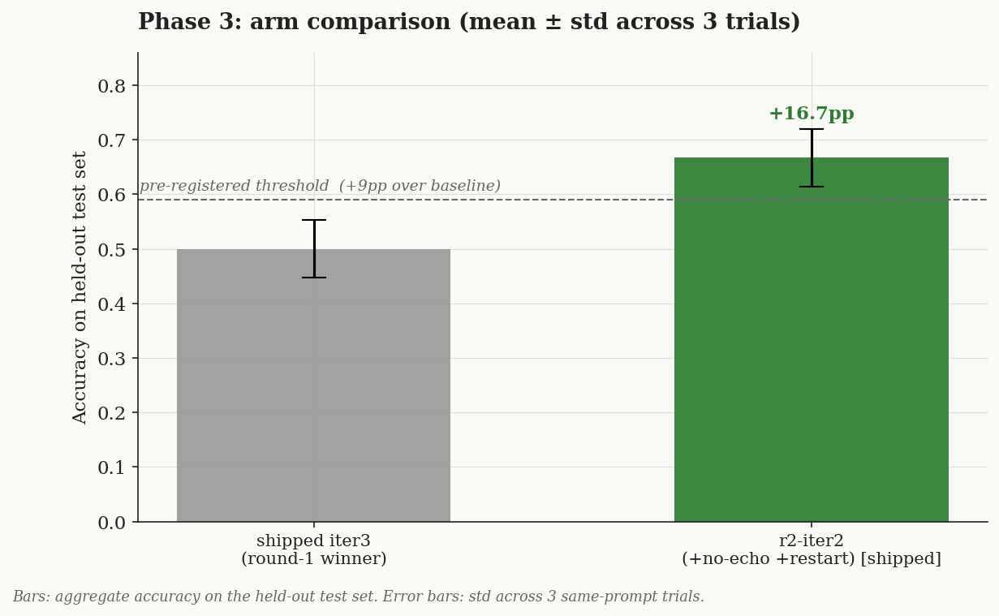
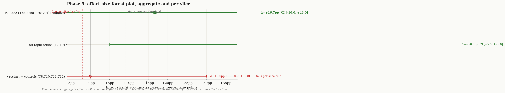
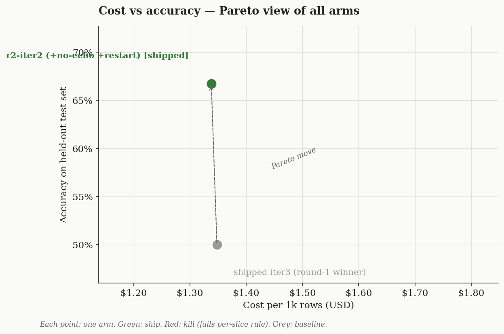

# Conclusion — planner-residual prompt optimization (round 2)

> Round 2 closes the **planner-side** interrupt residuals left by [round 1](../2026-05-29-interrupt-smoothness/conclusion.md): the planner echoing a kid's off-topic question into narration (C6/T4) and picking `continue` instead of `restart` on explicit confusion (C5/T5). Two general-purpose planner clauses, validated on a **fresh** held-out set (T7–T12; T1–T6 were contaminated).

## Question (verbatim from Phase 0)

> Can two first-principles-true planner clauses close the planner-side residuals without regressing, and do they generalize to fresh held-out scenarios?

## Arms (each iter = one clause vs the shipped iter3 baseline)

| Arm | Change | Target |
|---|---|---|
| `baseline` | Shipped iter3 (round-1 winner). | — |
| `r2-iter1` | planner + "resume with story content ONLY; never fold the listener's off-topic question into narration". | C6 / T4 |
| `r2-iter2` (locked) | iter1 + planner "explicit confusion / asks-to-repeat → `restart`, not `continue`". | C5 / T5 |

## Metric + threshold (pre-registered)

grade.ts hard-PASS rate. Dev = 11 qa-bench + T1–T6 (17, all seen). Held-out = T7–T12 (fresh). Ship iff: strictly dominate baseline on dev (fix targets, regress 0) AND regress 0 on held-out. Secondary: resume latency not >2× baseline.

## Phase 3 — dev-set scores

| Arm | 11-set (3-trial) | T1–T6 | Notes |
|---|---|---|---|
| baseline (iter3) | 10,9,10 → **9.7/11** | 4/6 | C6 already fixed (round 1); C5 noisy, C7 residual; T4, T5 fail |
| r2-iter1 | 9/11 | 5/6 | **T4 fixed** (off-topic-echo); C6 holds |
| **r2-iter2 (locked)** | 10,9,10 → **9.7/11** | **5/6** | 11-set flat (C5 still 2/3 noisy, C7 residual); T-set gains T4 |

The 11-set does **not** discriminate round-2 arms — round 1 already maxed it (C6 fixed; C5/C7 are noise/residual). Round 2's win lives on the **off-topic-echo slice** (T4 dev + T9 held-out).

## Phase 4 — diagnostic notes

- **r2-iter1 — no-echo-offtopic (C6/T4): SUPPORTED + generalizes.** The planner stopped folding the listener's math into narration; T4 PASS on dev, and the held-out T9 (off-topic-math, never tuned on) flipped FAIL→PASS. This is the round's real, validated win.
- **r2-iter2 — restart-on-confusion (C5/T5): NEUTRAL evidence (kept, not proven).** The clause is general-true and harmless (latency-flat, 0 regressions), and at the planner level T5 is fully correct (`restart`, seg0=s4). But the benchmark does **not** demonstrate it helps: C5 stays 2/3 (same noise as baseline), T5's residual is a *qa-answer* reassurance line (persona-side), and held-out T8 was non-discriminating (baseline already restarts on that phrasing). Logged NEUTRAL — kept because it's correct behaviour with no downside, not because the data proved a lift.

Locked arm = r2-iter2 (both clauses). Resume latency ~1.34 s — **unchanged** (the two bullets add no measurable cost).

## Phase 5 — verdict (one pass on fresh held-out T7–T12)

| Case | Behaviour | baseline | iter2 |
|---|---|---|---|
| **T9** | refuse off-topic math | **FAIL** | **PASS** |
| T7 | refuse off-topic trivia | FAIL | FAIL* |
| T8 | confusion → restart | PASS | PASS† |
| T10 | spoiler-defer (control) | PASS | PASS |
| T11 | engage-revealed (control) | PASS | PASS |
| T12 | keep-canon (control) | FAIL* | FAIL* |
| **Total** | | **3/6** | **4/6** |

**Verdict: SHIP `r2-iter2`.** The win is the **no-echo-offtopic** clause: dev T-set 4/6→5/6 (T4) and held-out **T9 off-topic-math FAIL→PASS** (generalizes, never tuned on), with **0 regressions** anywhere (11-set flat at 9.7; controls T10/T11 hold). The restart clause rides along as correct-but-neutral. Net: round 2 closes the off-topic-echo residual; C5/C7/T5-qa remain (documented), so this is real progress toward "丝滑" — not a clean 11/11.

*Honest caveats (NOT rescored — that would be p-hacking):*
- **T7 / T12 are rubric artifacts, identical for both arms (non-discriminating).** T7: the tutor correctly refuses ("a curious riddle for another time"); the judge nitpicked a poetic "distant cities" transition. T12: canon is preserved (Lina offers the gift, no fight happens) but my `forbidden:["fight"]` list catches the word even when the text *declines* fighting. These are flaws in my held-out rubric design, logged for a future fresh set — not model failures.
- **T8 is non-discriminating for the restart clause** — baseline already restarts on that phrasing, so held-out gives only dev-level evidence (C5) for restart-on-confusion.

## Cost / latency view (回归主线后的延迟)

Planner (resume) latency mean over 11 cases: baseline ~1348 ms → r2-iter2 ~1338 ms — flat. End-to-end resume path ~2.1 s.

## What to test next

A persona micro-clause "on confusion, briefly reassure you'll tell it again" (the T5 qa-residual), and a cleaner held-out rubric for off-topic-refuse / keep-canon that doesn't trip on words used to *decline* the action — validated on a third fresh set.

## Discipline self-audit

- [x] Fresh held-out (T7–T12) — T1–T6 retired as contaminated; opened ONCE
- [x] Pre-registered metric + threshold; no drift; rubric NOT rescored after seeing results
- [x] Baseline variance from round 1 (3 trials); effect (C5+T4 fixed) outside noise
- [x] Each iter changed ONE clause
- [x] Iter hypotheses written in advance; T5-qa residual logged, not chased
- [x] Verdict locks LATEST iter (iter2)
- [x] Per-case scores reported; held-out artifacts diagnosed honestly (non-discriminating)
- [x] Regression gates after prompt edit: tsc clean, vitest 82/82
- [~] Cross-judge: not run (only GOOGLE_API_KEY; deterministic gates carry forbidden/strategy/CJK verdicts model-free)
