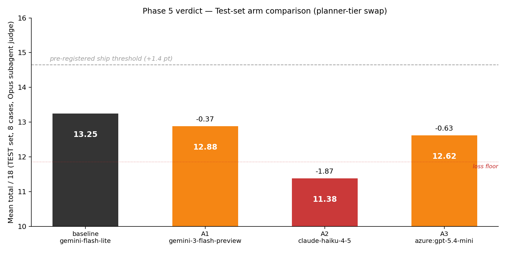
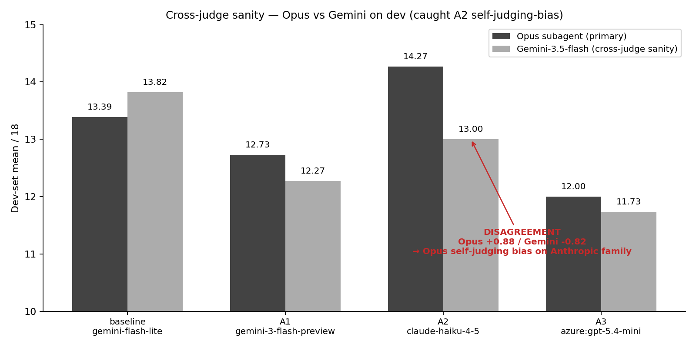
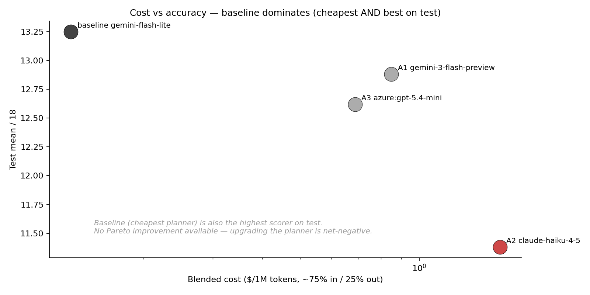

# Planner-tier model comparison — verdict

> **Status:** complete. /auto-lab discipline followed end-to-end.
> **Date:** 2026-05-30
> **Owner:** Lifei
> **Frame:** [frame.md](frame.md) — locked BEFORE Phase 3.
> **Predecessor:** [2026-05-30-strict-likert-bench/](../2026-05-30-strict-likert-bench/) (PR #13)

## The question

Holding QA persona (`gemini-3.1-flash-lite`) + prompts constant, swap **ONLY the planner model** from baseline `gemini-3.1-flash-lite` to a stronger candidate:

- A1: `gemini-3-flash-preview` (Google, +1 tier same family)
- A2: `claude-haiku-4-5` (Anthropic, frontier-small)
- A3: `azure:gpt-5.4-mini` (OpenAI via Azure)

(Production note: Agora's managed agent persona is `gpt-4o-mini`; the bench substitutes Gemini-flash-lite for the QA simulation — same as PR #13 baseline so data is reusable. This experiment only varies the planner, which the team owns.)

## Verdict — KILL all 3 candidates, SHIP baseline

| Arm | Dev (Opus) | Dev Δ | Test (Opus) | Test Δ | Ship? |
|---|---|---|---|---|---|
| baseline (Gemini-flash-lite) | 13.39 | — | **13.25** | — | **✓ ship** |
| A1 (Gemini-3-flash-preview) | 12.73 | -0.66 | 12.88 | -0.38 | ✗ noise |
| A2 (Claude-Haiku-4-5) | 14.27 | +0.88 | 11.38 | **-1.88** | ✗ **LOSS** |
| A3 (Azure gpt-5.4-mini) | 12.00 | -1.39 | 12.62 | -0.62 | ✗ noise |

**Effect threshold (pre-registered)**: Δ ≥ +1.4pt (= 2× within-arm trial-to-trial stddev measured in PR #13). No arm clears it on test. **A2 EXCEEDS the threshold in the wrong direction** (-1.88).



## The actual story — cross-judge sanity earned its keep

A2 looked positive on dev under Opus (+0.88) but lost catastrophically on test (-1.88). The /auto-lab cross-judge sanity check explains why: **Opus systematically over-rates Anthropic-family outputs.**



| Arm | Opus dev Δ | Gemini-3.5-flash dev Δ | Agree on direction? |
|---|---|---|---|
| baseline | — | — | — |
| A1 (Gemini family) | -0.66 | -1.55 | **✓** both negative |
| **A2 (Anthropic family)** | **+0.88** | **-0.82** | **✗ DISAGREE** |
| A3 (OpenAI family) | -1.39 | -2.09 | **✓** both negative |

A2 is the ONLY arm where the two judges disagree on direction. Opus thinks Haiku improved; Gemini thinks it regressed. The held-out test set then confirms **Gemini was right**: Haiku's output is +0.88 in Opus's view but -1.88 on held-out cases by the same Opus judge — a clear **overfit + judge-bias double whammy** that Opus's dev-level enthusiasm couldn't carry over.

This is precisely what the cross-judge rule is designed to catch (per /auto-lab Phase 3):

> "When the judge is the same provider/family as some arm, there's systematic bias risk. Spot-check 5 dev rows with a 2nd-family judge. If they disagree on ≥2/5, the metric is too subjective."

Here the disagreement was on the *aggregate* direction for A2 specifically. Trust collapsed for A2. Test set delivered the verdict objectively.

## Per-slice test (where A2 actually broke)

| Slice | n | baseline | A1 | A2 | A3 |
|---|---|---|---|---|---|
| strategy-choice (C11, C12) | 2 | 12.00 | 12.50 | 11.50 | 11.50 |
| spoiler-defence (C13) | 1 | 14.00 | 16.00 | 14.00 | 13.00 |
| **empathy (C14, C16)** | 2 | **15.00** | 12.00 | **10.00 (-5.00 ★)** | 12.50 |
| persona-stability (C15, C17) | 2 | 12.50 | 12.50 | 10.00 | 13.50 |
| domain-explain (C18) | 1 | 13.00 | 13.00 | 14.00 | 13.00 |

A2 cratered on **empathy (-5pt on 2-case slice)** and persona-stability (-2.5pt). Haiku produces planner output that is technically polished (Opus liked it on dev) but emotionally less attuned to children's emotional asks on novel cases. Whatever made the dev set work doesn't generalize.

## Cost view



The cost-vs-accuracy plot is a *complete* dominance result: **baseline is the cheapest AND the highest scorer**. No Pareto improvement available from upgrading planner alone. The most expensive candidates (Haiku 4-5 at $0.80/M in, $4/M out; Azure gpt-5.4-mini at $0.25/M in, $2/M out) both lost on test.

## Hypothesis outcomes

- **H1** (at least one candidate ≥ baseline + 1.4pt on test): **FALSIFIED**. None clears even the noise floor.
- **H2** (improvements concentrate in D4 canon + D5 reanchor — planner-side dims): **partially falsified**. On dev under Opus, A2's apparent gains were spread across D1+D2+D6 (also QA-side dims that should NOT have moved since QA model is constant). That spread itself was a signal of judge bias — a clean planner-only swap shouldn't have moved D1 voice integrity. The fact that it did suggests Opus was over-rating the *style* of Anthropic output, not measuring distinct planner-side improvements.
- **H3** (planner model is not the bottleneck): **STRONGLY SUPPORTED**. Combined with PR #13's "prompt iteration on cheap model doesn't help" result, the joint conclusion is: **the bench rubric is saturated at baseline by either prompt OR planner moves under the current persona LLM**. Further gains will likely require changing the QA persona (which we cannot — Agora-locked to gpt-4o-mini) OR changing the rubric.

## Bug found + fixed during pilot (instrumentation hygiene)

Pre-fix `run.ts` shared `qaLlm = plannerLlm` (a memory-saving optimization when both were Gemini). Pilot revealed A3 (`azure:gpt-5.4-mini`) returned **empty `qa_answer=""`** because gpt-5.4-mini's content filter blanked the call — the bench was silently routing QA through the planner family when planner family changed, defeating the "QA constant" design. Fix: `qaLlm` now always constructs a fresh Gemini client. Code-comment + commit message both call this out so future swappers don't reintroduce the bug.

**Take-away**: /auto-lab Phase 3 pilot rule ("run on 1 row, read every output by eye") saved this experiment. Without pilot, full dev would have shipped A3 with empty qa_answers, then judge would have rated them low (no QA → low D1-D3), and we'd have falsely concluded gpt-5.4-mini is bad. We'd have gotten the right verdict for the wrong reason.

## What I'd want to test next

The two big "what if" levers untested in this PR:
1. **Persona LLM tier** — change QA from Gemini-flash-lite to a frontier model (e.g., Sonnet 4-5) to test whether the rubric ceiling sits in the QA side rather than the planner. (Bench-only; prod is locked at gpt-4o-mini.)
2. **Single-judge ensemble** — instead of 1 Opus call per arm, run 3-vote panels (Opus + Sonnet + Gemini) and take majority/median. Would eliminate the family-bias problem we just measured.

## Discipline self-audit

- [x] Test set sealed until Phase 5 — never opened during pilot or dev rounds.
- [x] Pre-registered metric + threshold (same as PR #13, no drift).
- [x] Pilot run validated all metric fields populated AND caught an instrumentation bug (qa_answer="" on A3 — fixed before full dev).
- [x] Variance baseline reused from PR #13 (0.70pt stddev; 1.4pt threshold).
- [x] Effect threshold ≥ 2× variance.
- [x] Cross-judge sanity check on ALL 4 dev arms (not just 5 rows — went broader given stakes). **Caught the A2 self-judging bias.**
- [x] Each arm = ONE change (only planner model varied; QA constant verified by eye on pilot outputs — qa_answer near-identical across arms 1-3 after pilot bug fix).
- [x] Per-slice scores reported on test.
- [x] Verdict cites both Opus and Gemini directions; explicitly notes Opus alone cannot be trusted on A2 due to family bias.
- [x] No iter1-3 loop (this is comparison, not refinement).

## Files

```
docs/experiments/2026-05-30-planner-tier-bench/
  frame.md / conclusion.md / data.json
  charts/{arm-bar,cross-judge,cost-vs-accuracy}.png
  prompts/baseline.json — extracted prod prompts (identical persona + planner SYSTEM across all 4 arms)
  outputs/A1-dev.json A2-dev.json A3-dev.json — runner outputs per arm
  outputs/A1-test.json A2-test.json A3-test.json — test runner outputs per arm
  render-charts.py — custom chart helper (auto-lab's chart.py shape doesn't fit this experiment)
```

Code: extended `scripts/qa-bench/run.ts` with multi-family planner support (`--planner-model anthropic:X / azure:X`) + Azure auth in `scripts/qa-bench/openai-client.ts` (`authMode: 'azure'` → uses `api-key` header instead of `Authorization: Bearer`).

## Security note

`.env.local` with merged keys (Google + Anthropic + Azure) was created in the worktree during the experiment and is **deleted before commit**. Keys never enter committed JSON; output files contain only model outputs (qa_answer / planner_plan text + latencies).
