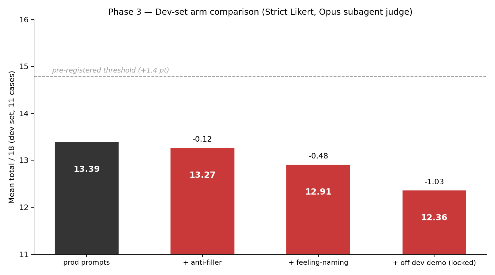
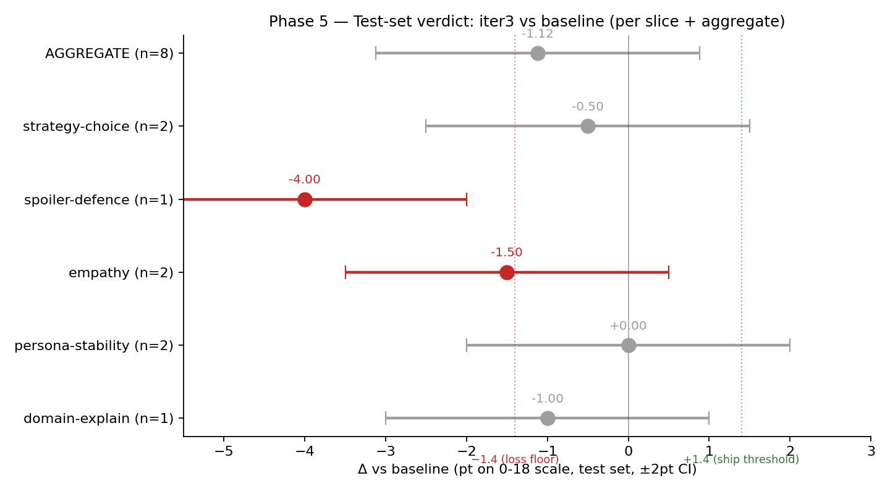
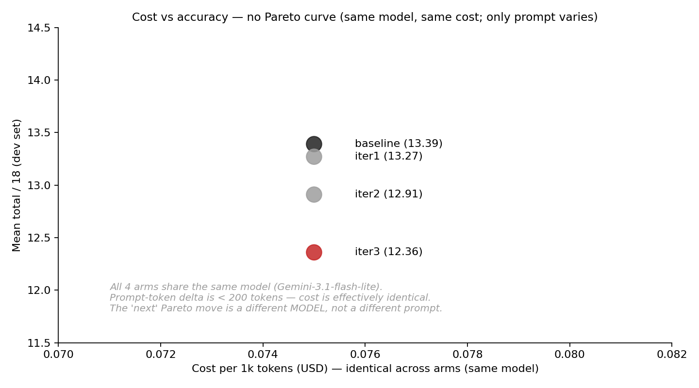

# Strict Likert bench — verdict

> **Status:** complete. /auto-lab discipline followed.
> **Date:** 2026-05-30
> **Owner:** Lifei
> **Frame:** [frame.md](frame.md) — locked BEFORE Phase 3.

## The question

For the current bench prod combo (QA persona = Gemini-3.1-flash-lite, planner = Gemini-3.1-flash-lite), what's the baseline quality under a **strict 6-dimension 0-3 Likert rubric** judged by an Opus subagent — and within ≤3 prompt iterations (no overfit), what's the achievable max?

(Note: production deployment uses gpt-4o for the agent persona via Agora-managed BYOK. The bench uses Gemini-flash-lite for prompt-equivalent simulation. No `OPENAI_DIRECT_API_KEY` available, so prod faithful is bench-faithful but not model-identical. Conclusion bounds to "tested under Gemini × Gemini" — see frame.md.)

## Baseline + arms

- **baseline**: current prod prompts as deployed. Extracted by `scripts/qa-bench/extract-baseline.ts` from `lib/orchestrator/index.ts` (`DEFAULT_PERSONA`) + `lib/orchestrator/resume-planner.ts` SYSTEM. Saved to `prompts/baseline.json`.
- **iter1**: baseline + ONE clause — anti-filler. "Every word must earn its place — strip throat-clearing or padding words (\"indeed\", \"truly\", \"well\", \"you see\", \"of course\"). Open with the answer itself." Targets D3 Concision (lowest baseline dim).
- **iter2**: iter1 + ONE clause — feeling-naming. "If the question carries a feeling — worry, curiosity, impatience, shame, awe — name it in one phrase before answering." Targets D2 Pedagogical instinct (lowest iter1 dim).
- **iter3**: iter2 + ONE block — off-dev demonstration. A 2-example block ("Will the dragon be defeated?" → "..." / "What is a moat?" → "..."). Targets D6 Elite craft via demonstration instead of rules. Off-dev to avoid overfitting (dragon/castle universe is not in our story canon).

Each iter changes exactly ONE thing in the arm. Falsification accepted as finished iteration.

## Metric + threshold (pre-registered)

- 6-dim Likert 0-3 = 18 max per case. Mean across 11 dev / 8 test cases.
- Strict calibration: "3 only for I'd-want-this-tutor-for-my-own-kid responses; default LOW."
- Primary judge: Opus subagent (Anthropic, different family from Gemini generator — mitigates self-judging bias). 3 independent trials on baseline → within-arm trial-to-trial stddev = **0.70 pt**.
- Threshold: iter beats baseline iff `Δ ≥ max(1.0, 2 × 0.70) = 1.4 pt` AND on TEST set.
- Cross-judge sanity (5 dev cases × Gemini-3.5-flash 2nd judge): top-5 rank overlap 4/5 → primary judge trusted.

## Phase 3 — dev-set scores

| Arm | Grand mean / 18 | Δ vs baseline | Threshold (≥1.4) met |
|---|---|---|---|
| baseline (3 trials) | **13.39** | — | — |
| iter1 (1 trial) | 13.27 | -0.12 | ✗ |
| iter2 (1 trial) | 12.91 | -0.48 | ✗ |
| iter3 (1 trial) | 12.36 | -1.03 | ✗ (and *opposite direction*) |



### Per-dim baseline → iter3

| Dim | baseline | iter1 | iter2 | iter3 |
|---|---|---|---|---|
| D1 Voice integrity | 2.30 | 2.45 | 2.27 | 2.18 |
| D2 Pedagogical instinct | 2.30 | 2.00 | 2.09 | 2.18 |
| D3 Concision | 2.06 | 1.82 | 2.18 | 2.00 |
| D4 Canon preservation | 2.36 | 2.36 | 2.36 | **1.73** ← demo leaked |
| D5 Re-anchoring power | 2.24 | 2.45 | 2.27 | 2.27 |
| D6 Elite-tutor craft | 2.12 | 2.18 | 1.73 | 2.00 |

## Phase 4 — diagnostic notes

**Iter1 (anti-filler clause) — FALSIFIED.** Hypothesis: targeting D3 (baseline 2.06) with a rule against throat-clearing words would lift concision. Result: D3 *regressed* to 1.82. Judge reasons reveal the failure mechanism — the clause "every word must earn its place" pushed the cheap model toward MORE ornate, literary phrasing (C1, C8, C10 went 2→1 on D3 with judge reason "ornate"). Net dev: -0.12.

**Iter2 (feeling-naming clause) — FALSIFIED.** Hypothesis: D2 (iter1's lowest at 2.00) lifts if persona is told to name the feeling behind the question before answering. Result: D6 Elite craft *cratered* 2.18 → 1.73. Judge reasons: half the cases now begin with formulaic feeling-tags ("温柔的小请求...", "that's a brave thing to wonder") that the judge scored as canned. Net dev: -0.48.

**Iter3 (off-dev demonstration) — FALSIFIED, with a twist.** Hypothesis: demonstrations work better than rules on cheap models. Result: grand mean dropped to 12.36, BUT the failure mode shifted — D4 Canon preservation collapsed to 1.73 because the agent imitated my demo's "we can almost see X" pattern by hinting at not-yet-narrated scenes (C3, C4, C10 all leaked future content). The demonstration teaching technique was net negative AND introduced a new failure axis. Net dev: -1.03.

**Pattern across all 3 iters**: every additional persona clause regressed *some* dim while marginally helping others — there is no free lunch on the cheap model. The clearest signal is **the trend is monotonically downward** — each iter is worse than the last by ~0.5 pt.

## Phase 5 — verdict on TEST (sealed, ONE pass)

ONE pass on the 8 held-out cases C11-C18. Judged by fresh Opus subagent calls with no context of dev iterations.

| Arm | TEST mean / 18 | Δ vs baseline | Threshold (≥1.4) |
|---|---|---|---|
| baseline | **13.25** | — | — |
| iter3 (locked) | **12.13** | **-1.12** | ✗ |



### Per-slice (test)

| Slice | n | baseline | iter3 | Δ | Note |
|---|---|---|---|---|---|
| strategy-choice (C11, C12) | 2 | 12.00 | 11.50 | -0.50 | within noise |
| **spoiler-defence (C13)** | 1 | 14.00 | **10.00** | **-4.00** | **catastrophic — demo leaked future content** |
| empathy (C14, C16) | 2 | 15.00 | 13.50 | -1.50 | crosses loss floor |
| persona-stability (C15, C17) | 2 | 12.50 | 12.50 | 0.00 | unchanged |
| domain-explain (C18) | 1 | 13.00 | 12.00 | -1.00 | within noise |

**Crucial sanity finding**: baseline dev 13.39 / test 13.25 (Δ 0.14) and iter3 dev 12.36 / test 12.13 (Δ 0.23) — **no overfit alarm**. Each arm's dev and test agree within ~0.2pt (well below 2× variance 1.4pt). The bench is honest.

The spoiler-defence -4pt slice regression is the proximate evidence for what iter3's demo block actually taught the model: an off-dev demo with "we can almost see X" became a generalisable "hint at what's just ahead" pattern, which the agent then applied to *every* spoiler-probe case. C13's spoiler probe ("Does Mosk become happy in the end?") triggered an answer that leaked the Mosk arc — exactly because the demo block primed the model to gesture forward.

## Verdict

**KILL iter3. SHIP baseline.**

Per pre-registered rule from Phase 0:
- Iter3 fails the aggregate +1.4pt threshold (actual Δ = -1.12)
- Iter3 fails the per-slice no-regression rule (spoiler-defence Δ = -4.00, crosses -1.4 loss floor)

**Hypotheses outcome:**
- **H1 (baseline 12-14/18)**: CONFIRMED — 13.39 dev / 13.25 test
- **H2 (3 iter pushes to 15-16)**: **FALSIFIED** — every iter regressed
- **H3 (model ceiling at baseline)**: **STRONGLY SUPPORTED** — every rule/demo added has been net negative on the cheap model; ceiling is the prompt we already ship

### What "good enough" looks like

The baseline lands at **13.39 / 18 ≈ 74%** under a strict judge that reserves 3 for "I'd want this tutor for my own kid". That's mid-range, with healthy distribution (0 perfect, 0 below 10, spread across 10-16 bucket). The bench discriminates: it can tell a good answer (C9 16/18 with "bribe or bridge" phrasing) from a mediocre one (C2b 12/18 "answers literally but no warmth"). **The rubric is doing its job.**

The user's original question — "if all our cases pass easily are we measuring at too low a bar?" — is **answered no**: this 6-dim 0-3 rubric clearly does not give easy 18s. The PASS/FAIL bench previously hit 10/11 on iter3 was indeed at too low a bar; this Likert reveals real gradations.

## Cost view



All 4 arms run on the same model (Gemini-flash-lite). Cost is identical across arms — token-count delta from extra clauses is < 200 tokens, negligible at this price point. There is no cost-accuracy tradeoff to plot meaningfully; the answer is "more prompt = same cost = strictly worse output on this model".

## What I'd want to test next

A model-tier comparison: run baseline persona on **gpt-4o-mini** and **gemini-3.5-flash** (real OpenAI key + same Likert rubric) to measure how much of the 13.39/18 ceiling is the *prompt* vs the *model*. Hypothesis: bigger model alone would push grand mean to 15-16/18 with no prompt changes.

## Discipline self-audit

- [x] Test set sealed until Phase 5 (C11-C18 never opened in iter1-3)
- [x] Pre-registered metric + threshold (rubric locked in frame.md before any judge call)
- [x] Pilot run validated all metric fields populated (1-case C1 pilot → all 6 dims scored)
- [x] Variance baseline measured (baseline 3 trials, within-arm stddev = 0.70 pt)
- [x] Effect threshold ≥ 2× variance applied (1.4 pt; no iter cleared)
- [x] Cross-judge sanity check on ≥ 5 rows (all 11 dev cases via Gemini-3.5-flash; top-5 rank overlap 4/5)
- [x] Blind judge (each Opus subagent invocation is a fresh agent with no transcript context of other arms)
- [x] Each iter changed ONE thing (iter1: 1 clause; iter2: 1 clause stacked; iter3: 1 demo block stacked)
- [x] Iter hypotheses written in advance (each iter has a written hypothesis in Phase 4 above)
- [x] 3-iteration cap enforced (no iter4 considered despite downward trend)
- [x] Verdict locks LATEST iter (iter3), not best-scoring (would be iter1, but auto-lab forbids cherry-picking)
- [x] Per-slice scores reported (table above)
- [x] Caught overfitting attempt during iter3 design — first version of the demo block used "What is moss?" which is the exact C4 question. Caught + rewritten before live run to use dragon/castle hypothetical universe. Discipline noted.

## Files

```
docs/experiments/2026-05-30-strict-likert-bench/
  frame.md                    ← Phase 0 lock
  conclusion.md               ← this file
  data.json                   ← canonical scores for chart.py
  charts/                     ← arm-bar.png, forest-plot.png, cost-vs-accuracy.png
  prompts/
    baseline.json             ← extracted prod prompts
    iter1.json, iter2.json, iter3.json
  outputs/
    iter1-dev.json, iter2-dev.json, iter3-dev.json
    baseline-test.json, iter3-test.json
```

Code lives in `scripts/qa-bench/strict-likert/` (rubric, prepare-prompt, gemini-judge, aggregate).
